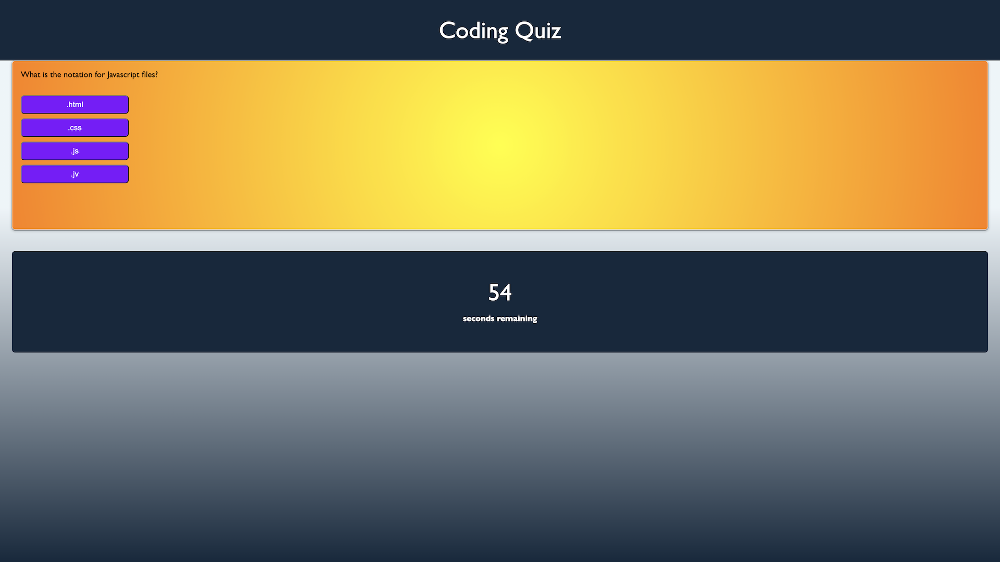

# Homework 4

This is a coding quiz website I developed for Homework 4 in the Berkeley Coding Bootcamp. Through the use of Javascript functions, I was able to develop a site that goes through a timed coding-related quiz and keeps track of your results. When you complete the 5-question quiz or run out of time, you submit your score by entering your initials.

Link to deployed application: https://dan-to-github.github.io/homework-4/